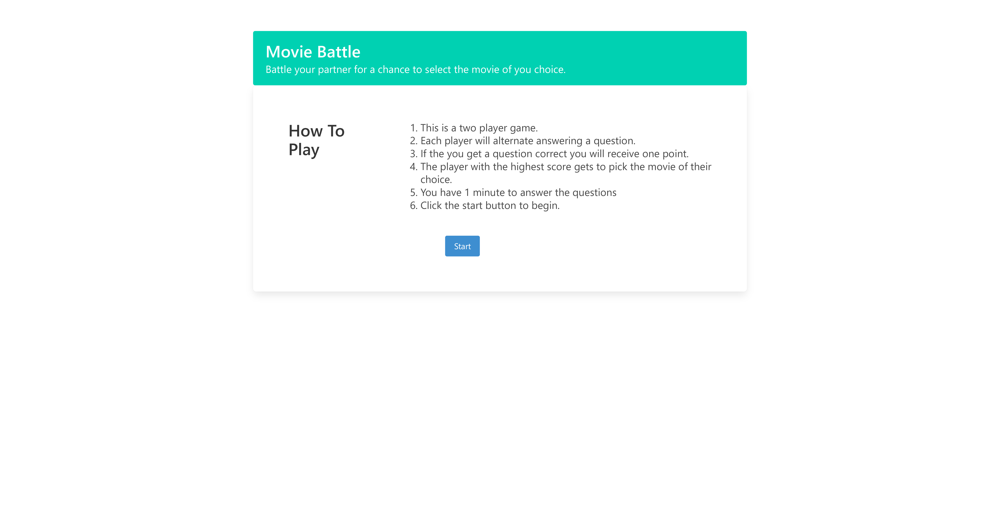

# Movie Battle

## Description

Movie Battle is an intense app that lets two people showcase their knowledge of the entertainment industry by playing a trivia game. The winner gets to pick which movie to watch and their high scores are saved. After the conclusion of the trivia game, the user is provided a search bar to select a variety of movies. the website will dynamically populate the questions and the movies with two seperate api keys that we used. we used Bulma as our CSS Framework. This was a collaborative effort and each developer had a fun time making Movie Battle

## Screenshot

## Live link

[Live Link](https://kelseyra.github.io/movie-battle/)
