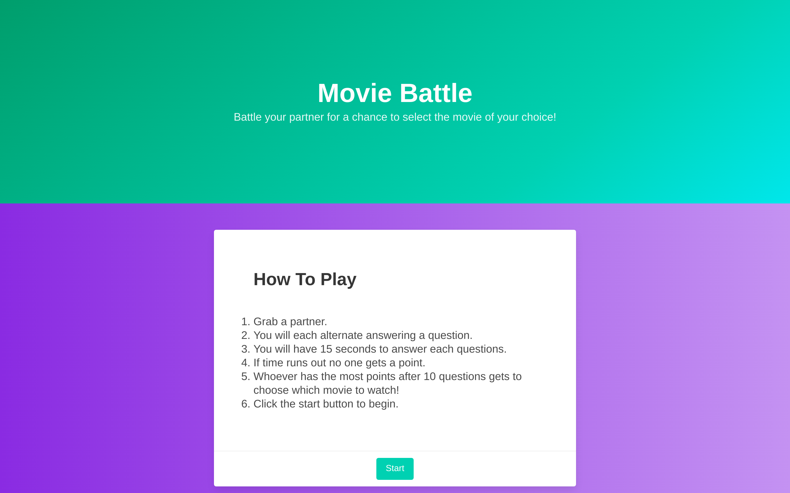

# Movie Battle

## Description

Movie Battle is a fun app that lets two people play a trivia game to decide what movie to watch. After hitting the start button, the game begins and the users are presented with timed questions. Whoever comes up with the correct answer clicks either Player 1 or Player 2 buttons. Their high scores are saved in local storage. After the conclusion of the trivia game, the user is provided a search bar to select a variety of movies. after inputing a movie name, you are given movie titles that are as close to the input that is provided. You can aslo view the Release year, rating, number of ratings, and synopisis of the movie. Bulma was the CSS framework we used to devliver a modern mobile first design. All of the movies and trivia questions were provided by two seperate API keys. This was a collaborative effort and each developer had a fun time making Movie Battle.

## Screenshot

## Live link

[Live Link](https://kelseyra.github.io/movie-battle/)
